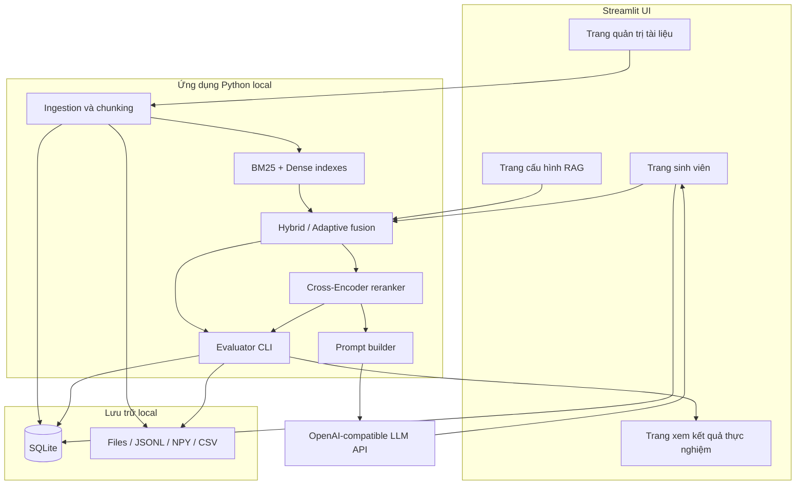

# Kế hoạch xây dựng hệ thống RAG và thực nghiệm Hybrid Retrieval cho tài liệu học tập tiếng Việt

## 1. Mục tiêu

Xây dựng một hệ thống RAG chạy local, có giao diện Streamlit cho hai vai trò:

- **Sinh viên:** hỏi đáp trên tài liệu học tập, xem nguồn trích dẫn và gửi phản hồi.
- **Quản trị viên:** quản lý tài liệu, lập chỉ mục, cấu hình RAG, chạy và xuất kết quả thực nghiệm.

Hệ thống phải phục vụ đồng thời hai mục tiêu:

1. Tạo sản phẩm minh họa RAG end-to-end có thể sử dụng và trình diễn.
2. Đo lường khách quan ảnh hưởng của BM25, Dense Retrieval, Hybrid Retrieval, Adaptive Hybrid và Reranker.

Phạm vi nghiên cứu chính vẫn là tầng retrieval. LLM, prompt và tham số generation phải được giữ cố định khi so sánh các cấu hình để không làm nhiễu kết quả.

## 2. Câu hỏi nghiên cứu và tính mới

### 2.1. Câu hỏi nghiên cứu

1. Hybrid Retrieval có cải thiện Hit Rate@K, MRR và NDCG@K so với BM25 và Dense Retrieval riêng lẻ không?
2. Reranker cải thiện bao nhiêu trên từng cấu hình retrieval?
3. RRF hay Weighted Sum phù hợp hơn với tài liệu học tập tiếng Việt?
4. Trọng số fusion thay đổi theo đặc trưng query có tốt hơn trọng số cố định không?
5. Cải thiện retrieval có chuyển thành câu trả lời RAG chính xác, có căn cứ hơn không?
6. Các cải thiện trên đánh đổi thế nào về latency và chi phí token?

### 2.2. Giả thuyết

- H1: Hybrid tốt hơn mô hình đơn lẻ tốt nhất trên tập test.
- H2: Hybrid + Reranker có MRR/NDCG cao nhất.
- H3: BM25 đóng góp nhiều hơn ở câu hỏi chứa mã môn học, thuật ngữ, công thức và số liệu; Dense đóng góp nhiều hơn ở câu hỏi paraphrase/khái niệm.
- H4: Adaptive Hybrid cải thiện chất lượng so với một `alpha` cố định mà gần như không tăng latency.
- H5: Cấu hình retrieval tốt hơn tạo ra câu trả lời có faithfulness và citation correctness cao hơn khi dùng cùng LLM/prompt.

### 2.3. Đóng góp đề xuất

Tính mới chính là **Adaptive Hybrid Retrieval theo đặc trưng truy vấn**. Điểm BM25 và Dense phải được chuẩn hóa riêng theo từng query trước khi fusion:

\[
score(d,q)=\alpha(q)\,score^{norm}_{BM25}(d,q)+(1-\alpha(q))\,score^{norm}_{Dense}(d,q)
\]

Với mỗi retriever và query, lấy top-L cố định rồi chuẩn hóa:

\[
score^{norm}(d,q)=\frac{score(d,q)-min(S_q)}{max(S_q)-min(S_q)}
\]

Nếu `max(S_q) == min(S_q)`, mọi candidate do retriever đó trả về nhận điểm 1; document không xuất hiện trong danh sách nhận điểm 0. Mặc định `L=100` và phải giữ nguyên giữa các cấu hình.

Adaptive Hybrid dùng heuristic có thể giải thích:

\[
S_{lex}(q)=w_1r_{digit}+w_2r_{symbol}+w_3r_{code}+w_4IDF_{max}
\]

\[
\alpha(q)=clip(\alpha_0+\beta S_{lex}(q),0.1,0.9)
\]

Trong đó `alpha_0` là trọng số cố định tốt nhất trên dev; `beta`, các trọng số và threshold chỉ được chọn bằng train/dev. Query có tính định danh cao tăng trọng số BM25; query diễn đạt tự nhiên tăng trọng số Dense. MVP không dùng regression hoặc mô hình phân loại để tránh overfit trên tập query nhỏ.

Đây là đóng góp tăng cường nhỏ, phù hợp phạm vi môn học. Không tuyên bố “phương pháp đầu tiên” nếu chưa hoàn tất rà soát tài liệu liên quan.

## 3. Kiến trúc tổng thể



### 3.1. Nguyên tắc kiến trúc

- Một ứng dụng Python/Streamlit chạy local; chưa cần FastAPI, React hay microservices.
- Embedding, BM25, fusion, reranking và dữ liệu chạy local.
- Chỉ query và các chunk đã chọn được gửi đến LLM API.
- SQLite giữ metadata và trạng thái; filesystem giữ tài liệu/index/artifacts lớn.
- Index mới chỉ trở thành active sau khi hoàn tất để tránh truy vấn trên dữ liệu dở dang.
- Mọi run thực nghiệm phải tái lập được từ config và hash dữ liệu.
- Benchmark dài chạy bằng CLI độc lập; Streamlit chỉ tạo config, đọc trạng thái và hiển thị artifacts trong `runs/`.

## 4. Stack đề xuất

- Python 3.11.
- UI và runtime: Streamlit.
- PDF: `PyMuPDF`; DOCX: `python-docx`; PPTX: `python-pptx`.
- BM25: `rank-bm25`; pilot so sánh whitespace tokenizer với `pyvi`, sau đó khóa một tokenizer và phiên bản cho toàn bộ thí nghiệm.
- Dense embedding: `sentence-transformers` với `BAAI/bge-m3`.
- Dense search: cosine similarity bằng NumPy; chỉ thêm FAISS nếu corpus lớn làm tìm kiếm chậm.
- Reranker: `BAAI/bge-reranker-v2-m3`, inference theo batch và khóa model revision; chỉ quantize sau khi benchmark latency chứng minh cần thiết.
- LLM: OpenAI-compatible API qua SDK chính thức, không xây lớp tích hợp nhiều provider ở MVP.
- Metadata: SQLite từ Python standard library.
- Artifacts: JSONL, NumPy và CSV.

CPU đủ cho demo nhỏ, nhưng reranker có thể chiếm phần lớn latency. GPU 12–16 GB giúp index/rerank nhanh hơn nhưng không bắt buộc; mọi khẳng định về latency phải dựa trên benchmark của máy thực nghiệm.

### 4.1. Cấu hình môi trường

```env
OPENAI_API_KEY=
OPENAI_BASE_URL=
OPENAI_MODEL=
```

API key chỉ được đọc từ `.env`/biến môi trường, không lưu trong SQLite, log hoặc Git.

## 5. Vai trò và giao diện

### 5.1. Sinh viên

Trang **Hỏi đáp** cung cấp:

- Khung chat và lịch sử trong phiên hiện tại.
- Câu trả lời tiếng Việt có citation dạng `[1]`, `[2]`.
- Nguồn có thể mở rộng để xem tên tài liệu, môn học, trang/slide, mục và đoạn trích.
- Thời gian phản hồi tổng; chi tiết kỹ thuật được ẩn mặc định.
- Nút hữu ích/không hữu ích và ô nhận xét.
- Thông báo rõ khi không tìm thấy đủ căn cứ trong tài liệu.

### 5.2. Quản trị viên

**Quản lý tài liệu**

- Upload PDF, DOCX, PPTX.
- Nhập môn học, loại tài liệu, học kỳ.
- Theo dõi trạng thái: đã tải, đã trích xuất, đã lập chỉ mục hoặc lỗi.
- Xem trước text/chunk và cảnh báo trang không trích xuất được.
- Tạo phiên bản corpus; giữ phiên bản cũ để tái lập thực nghiệm.
- Không xóa trực tiếp tài liệu đã thuộc benchmark bị khóa.

**Cấu hình RAG**

- Chọn BM25, Dense, Hybrid RRF, Weighted Sum hoặc Adaptive Hybrid.
- Bật/tắt reranker.
- Chỉnh top-N, top-K, RRF `k`, `alpha` và ngưỡng từ chối.
- Chọn LLM model và temperature; mặc định temperature bằng 0.
- Lưu cấu hình có tên để dùng lại.

**Thực nghiệm**

- Tạo và xuất config gồm corpus version, query set, qrels và các cấu hình cần chạy.
- Đọc trạng thái/lỗi từ run do CLI thực hiện; không chạy benchmark dài trong tiến trình Streamlit.
- So sánh metrics, latency và chi phí.
- Lọc theo loại query, loại tài liệu và môn học.
- Xuất CSV/JSON cho báo cáo.

### 5.3. Xác thực local

Dùng hai tài khoản local cấu hình sẵn và mật khẩu được hash. Không triển khai OAuth, đăng ký tài khoản hoặc phân quyền phức tạp ở MVP.

## 6. Pipeline dữ liệu và lập chỉ mục

### 6.1. Corpus

Thu thập cân bằng giáo trình, slide và đề thi từ nhiều môn nếu phạm vi cho phép. File gốc là bất biến. Manifest gồm `doc_id`, tên môn, loại tài liệu, học kỳ, phiên bản và SHA-256.

### 6.2. Tiền xử lý

1. Trích xuất text theo trang/slide và giữ heading.
2. Chuẩn hóa Unicode, khoảng trắng, ngắt dòng; giữ dấu tiếng Việt, mã hiệu, ký hiệu và số.
3. OCR chỉ cho trang scan không có text layer và ghi cờ `ocr=true`.
4. Với PPTX, lấy title trước; gom text box theo dải ngang rồi sắp xếp trên-xuống, trái-phải; đọc table theo hàng/cột và bỏ shape trang trí. Admin phải xem được preview để phát hiện layout nhiều cột bị sai.
5. Chunk theo heading, mặc định 450 tokens, overlap 75 tokens; gắn heading vào đầu chunk.
6. Ghi `chunk_id`, `doc_id`, `course`, `source_type`, `page`, `section`, `text`.
7. Xây BM25 index và dense embedding từ đúng cùng tập chunk.

Thử 300/450/700 tokens trên pilot, chọn một cấu hình rồi khóa trước thí nghiệm chính. Không đổi chunking giữa các retriever.

### 6.3. Quản lý phiên bản

Mỗi corpus version lưu:

- Hash danh sách file và từng file.
- Cấu hình parser/chunking.
- Tokenizer và embedding model revision.
- Thời gian tạo, số tài liệu/chunk và trạng thái.
- Đường dẫn index artifacts.

## 7. Luồng RAG

1. Nhận query và cấu hình active.
2. Chuẩn hóa query nhưng giữ nguyên mã, số và ký hiệu.
3. BM25 và Dense truy xuất song song.
4. Với Weighted Sum, lấy top-L cố định từ mỗi retriever, tạo hợp candidate rồi min-max normalize score riêng theo từng query. Candidate thiếu ở một nhánh nhận điểm 0; nếu `max == min`, mọi candidate do nhánh đó trả về nhận cùng điểm 1.
5. Fusion bằng RRF, Weighted Sum hoặc Adaptive Weighted Sum.
6. Reranker xếp lại top-N theo batch; lấy khoảng 5 chunk làm context.
7. Kiểm tra retrieval confidence bằng threshold được hiệu chỉnh riêng trên dev cho từng phương pháp. Nếu dưới ngưỡng, trả lời không đủ thông tin mà không gọi LLM, hoặc gọi LLM với chỉ dẫn từ chối nghiêm ngặt theo cấu hình.
8. Prompt đánh số context `[1]...[5]` và yêu cầu mọi kết luận dựa trên context.
9. Gọi OpenAI-compatible API với temperature 0.
10. Parse citation, loại citation không tồn tại và ánh xạ về trang/slide.
11. Hiển thị câu trả lời, nguồn và latency; lưu log lượt hỏi và feedback.

Prompt hệ thống phải yêu cầu:

- Chỉ sử dụng context được cung cấp.
- Không tự tạo nguồn hoặc số liệu.
- Nêu rõ không đủ thông tin nếu context không hỗ trợ.
- Gắn citation ngay sau phát biểu tương ứng.
- Trả lời bằng tiếng Việt, trừ khi người dùng yêu cầu khác.

## 8. Benchmark và qrels

Mục tiêu 300–500 query được người kiểm tra; 200 là mức tối thiểu. Phân tầng:

- 25% mã môn học, thuật ngữ, tên riêng, số liệu hoặc ký hiệu.
- 35% câu hỏi khái niệm/paraphrase.
- 20% câu hỏi tình huống/vận dụng.
- 20% câu hỏi cần liên kết nhiều đoạn hoặc nhiều trang.

Không dùng toàn bộ câu hỏi sinh trực tiếp từ một chunk vì gây thiên vị lexical matching. Ưu tiên câu hỏi thật; câu hỏi do LLM sinh chỉ là ứng viên và phải được người duyệt/paraphrase.

Nhãn relevance:

- 0: không liên quan.
- 1: hỗ trợ nhưng chưa đủ.
- 2: chứa thông tin trực tiếp để trả lời.

Chia query 60/20/20 thành train/dev/test, phân tầng theo loại query và môn học. Chỉ dùng dev để chọn tham số; test bị khóa đến lần chạy cuối. Hai người gán nhãn độc lập ít nhất 20% mẫu và báo cáo Cohen's kappa.

Qrels được tạo bằng pooling từ hợp top kết quả của BM25, Dense và Hybrid; ẩn tên hệ thống và trộn thứ tự trước khi gán nhãn.

## 9. Ma trận thực nghiệm retrieval

| ID | Retriever | Fusion | Reranker | Vai trò |
|---|---|---|---|---|
| E0 | BM25 | Không | Không | Baseline sparse |
| E1 | Dense | Không | Không | Baseline semantic |
| E2 | BM25 + Dense | RRF | Không | Hybrid ổn định |
| E3 | BM25 + Dense | Weighted Sum cố định | Không | Hybrid tối ưu alpha chung |
| E4 | BM25 + Dense | RRF | Có | RRF + reranker |
| E5 | BM25 + Dense | Weighted Sum cố định | Có | Weighted + reranker |
| E6 | BM25 + Dense | Adaptive Weighted Sum | Không | Phương pháp đề xuất |
| E7 | BM25 + Dense | Adaptive Weighted Sum | Có | Phương pháp đề xuất đầy đủ |

Tuning chỉ trên dev, sau khi cố định cách chuẩn hóa score:

- Fixed Weighted Sum: `alpha = 0, 0.25, 0.5, 0.75, 1`, sau đó tinh chỉnh bước 0.1 quanh điểm tốt nhất.
- Adaptive Weighted Sum: dùng heuristic đã mô tả; chọn `beta`, trọng số và threshold từ train/dev, không dùng test. Thực hiện ablation từng đặc trưng như phân tích phụ.
- RRF: `k = 10, 30, 60`.
- Candidate pool trước rerank: thử `N = 20, 50, 100` offline; demo CPU mặc định `N = 20`.
- Báo cáo tại `K = 1, 3, 5, 10`.

Giữ nguyên embedding và reranker trong thí nghiệm chính. So sánh model khác chỉ là thí nghiệm phụ.

## 10. Đánh giá

### 10.1. Retrieval

Chỉ số chính được quy định trước khi mở tập test:

- Hit Rate@5.
- MRR@10.
- NDCG@10 với nhãn 0/1/2.

Chỉ số phụ:

- Precision@K, Recall@K.
- p50/p95 latency, thời gian index, kích thước index và peak memory.
- Kết quả theo loại query, tài liệu và môn học.

So sánh theo cặp trên cùng query. Báo cáo chênh lệch tuyệt đối, tương đối và bootstrap 95% confidence interval. Chỉ kết luận cải thiện khi khoảng tin cậy của chênh lệch không chứa 0.

Hai so sánh chính được xác định trước: E7 với baseline đơn lẻ tốt nhất **được chọn trên dev** và E7 với hybrid cố định tốt nhất **được chọn trên dev**. Các cặp còn lại là exploratory; nếu dùng để kiểm định khẳng định, phải hiệu chỉnh multiple comparisons.

### 10.2. RAG end-to-end

Dùng 50–100 câu hỏi từ test set để so sánh ít nhất:

- Dense RAG.
- Hybrid RAG tốt nhất với trọng số cố định.
- Adaptive Hybrid + Reranker RAG.

Giữ cùng LLM model, prompt, temperature và context budget. Đánh giá:

- Answer correctness/relevance theo thang 1–5.
- Faithfulness: phát biểu có được context hỗ trợ không.
- Citation correctness và citation completeness.
- Tỷ lệ từ chối đúng/sai.
- p50/p95 end-to-end latency và token cost.
- Feedback hữu ích/không hữu ích từ người dùng thử.

LLM-as-judge chỉ dùng làm số liệu phụ; đánh giá con người là nguồn kết luận chính.

### 10.3. Phân tích lỗi

Phân tích tối thiểu 30–50 query thất bại và chia nhóm: lỗi parse/OCR, chunk sai biên, thiếu qrel, exact-match thất bại, semantic mismatch, fusion sai thứ hạng, reranker đảo sai, citation sai, hallucination và câu hỏi cần nhiều chunk.

## 11. Lưu trữ

### 11.1. SQLite

Các bảng tối thiểu:

- `users`: tài khoản local và vai trò.
- `documents`: metadata và trạng thái xử lý.
- `corpus_versions`: phiên bản index và hash.
- `rag_configs`: cấu hình có tên.
- `chat_sessions`, `messages`: lịch sử và citation.
- `feedback`: đánh giá người dùng.
- `experiment_runs`: config, trạng thái và kết quả tổng hợp.

Không lưu embedding hay file tài liệu trực tiếp trong SQLite.

### 11.2. Filesystem

```text
data/
  raw/<corpus_version>/
  processed/<corpus_version>/chunks.jsonl
  indexes/<corpus_version>/
  benchmark/queries.jsonl
  benchmark/qrels.jsonl
runs/<run_id>/
  config.json
  metrics.json
  per_query.csv
  errors.csv
```

## 12. Cấu trúc mã nguồn dự kiến

```text
app.py
run_experiments.py
pages/
  1_Chat.py
  2_Documents.py
  3_RAG_Settings.py
  4_Experiments.py
src/
  ingestion.py
  retrieval.py
  reranking.py
  rag.py
  evaluation.py
  storage.py
configs/
  default.yaml
tests/
  test_core.py
.env.example
requirements.txt
README.md
```

Không tạo interface/factory cho từng retriever hoặc LLM ở MVP. Các hàm nhỏ và cấu hình rõ ràng là đủ; chỉ tách abstraction khi xuất hiện provider/implementation thứ hai thực sự.

## 13. Xử lý lỗi và an toàn

- File lỗi chỉ làm thất bại file đó, không phá cả corpus.
- Chưa có active index thì khóa chat và hướng dẫn admin lập chỉ mục.
- API timeout/rate limit retry tối đa hai lần với backoff ngắn.
- Không log API key; hạn chế lưu nguyên văn dữ liệu nhạy cảm.
- Kiểm tra loại file, kích thước và tên file trước khi lưu.
- Không cho đường dẫn upload thoát khỏi thư mục dữ liệu.
- LLM output được hiển thị như text/Markdown an toàn, không thực thi HTML tùy ý.
- File có bản quyền và `.env` không commit Git.

## 14. Kiểm thử

- Unit test cho chunking, tokenizer, min-max normalization, adaptive alpha, fusion, citation parsing và metrics.
- Unit test cho PPTX reading order với slide một cột, hai cột và table nhỏ.
- Integration test: tài liệu mẫu → chunk → index → query → context.
- Mock LLM API để kiểm thử prompt/citation mà không tốn phí.
- Smoke test khởi động Streamlit và truy cập các trang chính.
- Smoke test CLI tạo run, ghi checkpoint và tiếp tục sau lỗi giả lập.
- Golden set 10 câu hỏi để phát hiện regression nhanh.
- Chạy benchmark đầy đủ trước mọi kết luận nghiên cứu.

## 15. Khả năng tái lập

Mỗi experiment run lưu:

- Git commit nếu dự án dùng Git.
- Seed.
- Model name và revision.
- Hash corpus, queries và qrels.
- Parser/chunking/tokenizer config.
- Retrieval, fusion, reranker và LLM config.
- Prompt version.
- Python/dependency versions và thông tin phần cứng.

`python run_experiments.py --config <path>` là đường chạy benchmark chuẩn và có khả năng tiếp tục từ kết quả trung gian. Streamlit chỉ tạo config và đọc artifacts. Cả CLI và UI dùng cùng hàm lõi, không cài lại logic retrieval riêng.

Các chỉ số, giả thuyết, phép so sánh chính và cấu hình đã khóa mới chỉ là **pre-specification**. Chỉ gọi là pre-registration khi protocol được đóng băng bằng Git commit/tag hoặc bản có timestamp trước khi mở tập test.

## 16. Lộ trình 8 tuần

| Tuần | Công việc | Đầu ra |
|---|---|---|
| 1 | Chốt corpus, schema, annotation guideline và wireframe Streamlit | Manifest, schema, 20 query mẫu |
| 2 | Parser, chunking, versioning và xây mini-dev 30–50 query | `chunks.jsonl`, mini-dev, báo cáo extraction |
| 3 | BM25, pilot tokenizer, Dense, metrics và baseline | Tokenizer khóa, E0–E1 tái lập được |
| 4 | Hoàn thiện query/qrels và kiểm tra liên chủ thể | Benchmark khóa, Cohen's kappa |
| 5 | Fusion, reranker, Adaptive Hybrid và tuning trên dev | E2–E7, cấu hình khóa |
| 6 | RAG với OpenAI-compatible API, citation và từ chối | Pipeline end-to-end |
| 7 | Streamlit cho sinh viên/admin, feedback và export | Demo local hoàn chỉnh |
| 8 | Chạy test một lần, CI, latency, cost và error analysis | Bảng/biểu đồ, kết luận báo cáo |

Nếu chỉ có 6 tuần, gộp tuần 1–2 và 6–7; không cắt việc khóa test, qrels hay baseline.

## 17. Tiêu chí hoàn thành

- Hai vai trò sử dụng được trên Streamlit local.
- Admin upload tài liệu, tạo corpus version và lập index thành công.
- Sinh viên hỏi đáp, xem citation theo trang/slide và gửi feedback.
- Corpus/benchmark/config/run đều có version hoặc hash.
- Ít nhất 200 query đã duyệt; mục tiêu 300–500.
- Test không dùng để chọn chunk size, alpha, RRF k, candidate N, threshold hoặc model.
- E0–E7 dùng cùng pipeline và xuất kết quả từng query.
- Benchmark chạy bằng CLI, có trạng thái và tiếp tục được sau lỗi; Streamlit không giữ tác vụ dài.
- Có retrieval metrics, RAG metrics, 95% CI, latency, token cost và error analysis.
- So sánh E7 với baseline đơn lẻ tốt nhất và hybrid cố định tốt nhất.
- Hệ thống từ chối khi không có đủ căn cứ và không tạo citation không tồn tại.

Ngưỡng thành công nghiên cứu được đặt trước: E7 tăng ít nhất 5% tương đối ở Hit Rate@5 hoặc MRR@10 so với baseline đơn lẻ tốt nhất, hoặc tăng có ý nghĩa so với hybrid cố định ở một nhóm query đã đăng ký trước, với bootstrap 95% CI không chứa 0. Nếu không đạt, kết quả âm vẫn hợp lệ khi phương pháp và benchmark được kiểm soát đúng.

## 18. Ngoài phạm vi MVP

Không triển khai React, FastAPI, Docker/Kubernetes, vector database, background queue, OAuth, đăng ký tài khoản, knowledge graph, fine-tuning hay multi-agent. Chỉ bổ sung khi cần triển khai nhiều người dùng, corpus vượt khả năng NumPy hoặc câu hỏi nghiên cứu được mở rộng.
